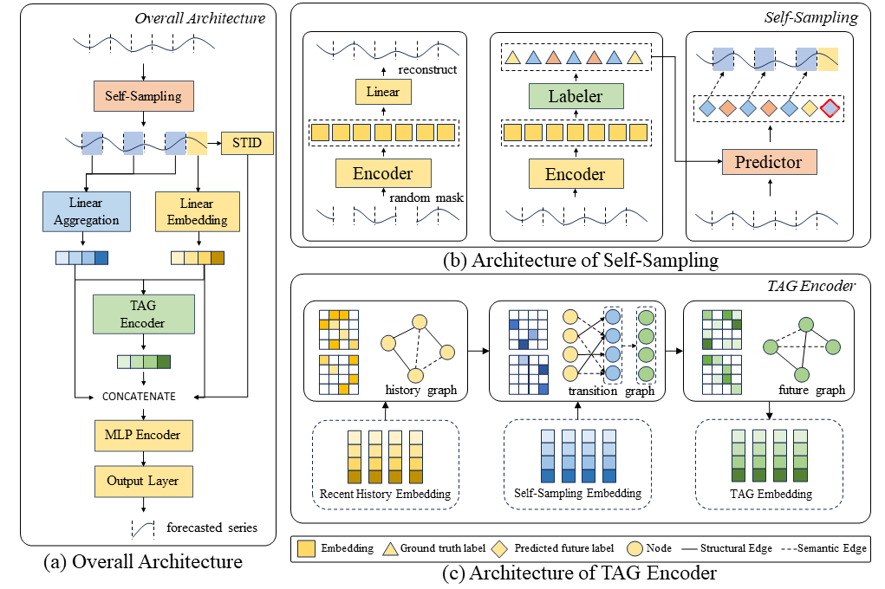

# Temporal-Aware Structure-Semantic-Coupled Graph Network for Traffic Forecasting



## 1. Environment

Our experiments are conducted based on Python 3.9 and Pytorch 1.21.1. You can install Pytorch following the instructions of [Pytorch](https://pytorch.org/get-started/previous-versions/).

And you can use the following command to install other packages needed for experiments.

```
pip install -r requirements.txt
```

## 2. Data Preparation

### 2.1 Download Data

The datasets used in our paper are collected by the Caltrans Performance Measurement System(PeMS). The raw data can be downloaded from [ASTGNN](https://github.com/guoshnBJTU/ASTGNN/tree/main/data) (IEEE TKDE2021)

After downloading, the raw data should be placed as follows.

```
./data/PEMS03/PEMS03.npz
./data/PEMS04/PEMS04.npz
./data/PEMS07/PEMS07.npz
./data/PEMS08/PEMS08.npz
```

### 2.2 Data Process

Taking dataset PEMS08 for example, you can use the following commands to generate time series data from raw data.

```
python generate_time_series_data.py --data_name=PEMS08
```

## 3. Training

### 3.1 Encoder

After generating the time series data, use the following command to train the encoder and save the encoded representation.

```
python train_encoder.py --data_name=PEMS08
```

### 3.2 Labeler

After training the encoder, use the following command to train the labeler to generate and save labels.

```
python train_labeler.py --data_name=PEMS08
```

### 3.3 Predictor

After label generation, use the following command to train the predictor to predict the label of future series from the history series.

```
python train_predictor.py --data_name=PEMS08
```

### 3.4 Self-Sampling

After generating the predicted label, use the following command to generate the self-sampling series index, which will be used to generate temporal-aware graphs in TASSGN.

```
python generate_self_sampling_index.py --data_name=PEMS08
```

### 3.5 TASSGN

Finally, use the following command to train TASSGN and get the final test result.

```
python train_TASSGN.py --data_name=PEMS08
```

